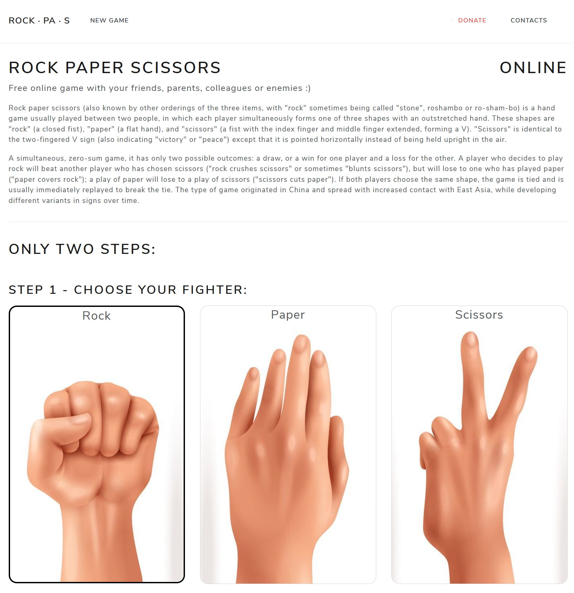

# RockPas.com

Source code of my tiny pet project. Online realisation of [Rock Paper Scissors game](https://rockpas.com). Try it with friends! :)



For local running, setup your MySQL database in `appsetting` file and replace `YOUR_API_KEY` and `YOUR_API_SECRET` for google recaptcha:

```json
{
    "Main": {
        "Host": "http://localhost:5001"
    },
    "DataBase": {
        "ConnectionString": "Server={0};Database={1};Uid={2};Pwd={3};SslMode=none;Allow User Variables=True;CharSet=utf8mb4;",
        "DbHost": "localhost",
        "DbName": "rpsgame",
        "DbLogin": "root",
        "DbPassword": ""
    },
    "Security": {
        "Salt1": "Salt1",
        "Salt2": "Salt2"
    },
    "GoogleRecaptcha": {
        "ApiKey": "YOUR_API_KEY",
        "ApiSecret": "YOUT_API_SECRET"
    },
    "Donate": {
        "PayPal": "https://www.paypal.com/cgi-bin/webscr?cmd=_s-xclick&hosted_button_id=SJ4TQYVRWD4EE&item_name=Donate%20for%20Rockpas.com"
    }
}
```
